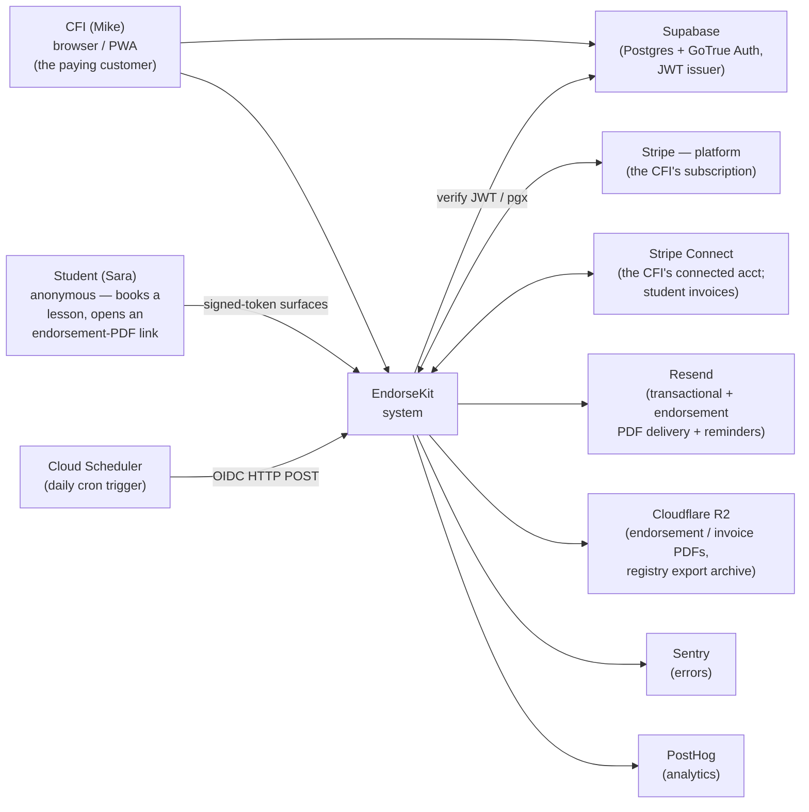
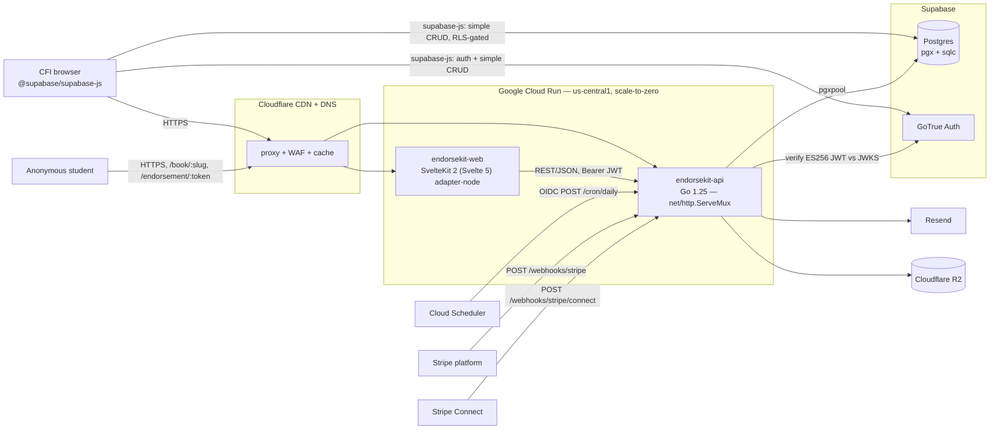

# 02 — Architecture

> **Status: DRAFT — awaiting founder review. No founder approval is
> recorded.** Discovery ([01-discovery.md](01-discovery.md)) defines what
> we're building; this file defines how it's wired together. Source of
> truth for stack choices: [docs/product-research.md](product-research.md)
> §2–§4 — this document refines that plan. The five ADRs it relies on
> ([0001](adr/0001-go-backend-for-endorsements-and-jobs.md)–[0005](adr/0005-billing-model.md))
> are `Status: proposed`; Phase 2's first action on founder approval is
> to flip them to `accepted`.

## 1. System context (C4 L1)



External actors and systems:

- **CFI (Mike)** — the paying customer. Authenticates; configures lesson
  types and availability; manages bookings; issues endorsements;
  searches the registry; manages the roster; onboards Stripe Connect and
  sends invoices.
- **Student (Sara)** — anonymous. Reaches EndorseKit only through
  unauthenticated, HMAC-signed-token surfaces — the public booking page,
  the booking-confirmation page, and the endorsement-PDF download link.
- **Cloud Scheduler** — fires the daily booking/lesson reminder cron via
  an OIDC-authed POST.
- **Supabase** — Postgres (all app data) + GoTrue Auth (email/password,
  magic link, Google OAuth for the CFI; ES256 JWT issuer). RLS enabled.
- **Stripe — platform** — Checkout, Customer Portal, Billing for the
  CFI's own $12/mo subscription.
- **Stripe Connect** — each CFI's connected account; student invoices
  are created on the connected account; funds settle to the CFI.
- **Resend** — transactional email, endorsement-PDF delivery, daily
  reminders.
- **Cloudflare R2** — server-generated endorsement PDFs, invoice PDFs,
  and the registry export archive (the durable legal copy of record).
- **Sentry / PostHog** — errors and analytics.

Out of scope for V1: no SMS provider, no Web Push, no native app, no
Python/ML service, no FAA integration.

## 2. Containers (C4 L2)

EndorseKit is **two application runtime containers** on Cloud Run, plus
the browser runtime.



| Container          | Tech                                          | Responsibilities                                                                                                  | Trust boundary                     |
| ------------------ | --------------------------------------------- | ----------------------------------------------------------------------------------------------------------------- | ---------------------------------- |
| `endorsekit-web`   | SvelteKit 2 (Svelte 5 runes), adapter-node    | SSR pages — the CFI app + the public booking page; auth UI; PWA shell; simple CFI-owned CRUD (browser-direct via supabase-js); proxies backend-backed calls to the API | Public HTTPS (Cloudflare-proxied)  |
| `endorsekit-api`   | Go 1.25, stdlib `net/http.ServeMux`           | Endorsement issuance + the append-only registry, endorsement/invoice PDF rendering, the booking/lesson reminder cron, Stripe Checkout + Connect, the webhook receivers, all privileged SQL | Public HTTPS; per-route auth (JWT / OIDC / signed token / Stripe signature) |
| `browser`          | `@supabase/supabase-js` in the CFI's user agent | Auth UI; simple CRUD on CFI-owned tables via PostgREST + RLS                                                     | RLS-gated (every query carries the CFI JWT) |

### Why two containers

Per [ADR-0001](adr/0001-go-backend-for-endorsements-and-jobs.md):
EndorseKit has server-side endorsement-PDF generation (a legal artifact,
rendered from sealed data), a daily reminder cron, and Stripe Connect
(its own webhook surface + onboarding state) — three jobs a
request-driven SvelteKit-on-scale-to-zero runtime handles poorly. The Go
service owns those; the web tier keeps the UI and the simple CRUD.

### Internal modules within `endorsekit-api`

```
backend/
  cmd/server/          → main(): resolve env → build deps → server.Run
  internal/
    server/            → net/http.ServeMux wiring, middleware chain
    auth/              → ES256 JWT verification (JWKS cached); OIDC verify;
                         HMAC signed-token mint/verify (public surfaces)
    endorsements/      → THE LEGAL-RECORD CORE — endorsement issuance, the
                         AC 61-65 catalog, the append-only registry, the
                         HMAC seal + hash chain + the chain verifier
    pdf/               → pure-Go server-side PDF rendering (endorsements +
                         invoices) — deterministic, from sealed data
    bookings/          → lesson-type + availability + booking CRUD; the
                         public booking-page + booking-submission handlers
    students/          → the CFI's roster + the ACS-progress checklist
    reminders/         → the daily cron handler + the re-engagement nudge
    billing/           → Stripe Checkout (CFI subscription, platform acct)
                         + Stripe Connect (CFI→student invoicing) + the two
                         webhook receivers
    db/                → sqlc-generated queries + the pgxpool
      queries/         → *.sql source for sqlc
    ratelimit/         → in-process token bucket
    metrics/           → log-based metric emission helpers
```

The `endorsements` package is the legal-record heart of the product —
the most carefully tested package, the one place the registry's
append-only contract and the seal are implemented.

### Internal modules within `endorsekit-web`

```
web/src/
  routes/
    (auth)/            → CFI signup, login, magic-link/OAuth callback
    app/               → authenticated CFI UI: dashboard, lesson types,
                         availability, bookings, students, endorsement
                         issuance, the registry, invoices, settings
    book/[slug]/       → the PUBLIC booking page (unauthenticated)
    endorsement/[token]/ → the PUBLIC endorsement-PDF surface (signed token)
    api/               → SvelteKit server routes — ONLY for paths that
                         need a server secret (Stripe Checkout/Portal
                         session creation, R2 presign) or that proxy an
                         authenticated call through to the Go API
    legal/             → terms, privacy, refund
  hooks.server.ts      → @supabase/ssr session; security headers
  lib/
    supabase.ts        → browser supabase-js client
    server/            → server-side supabase client, API proxy client
```

## 3. Critical flows

### 3.1 CFI signup + onboarding

```
CFI browser        Supabase Auth          endorsekit-api
  │                     │                        │
  │ supabase.auth.signUp / signInWithOtp / OAuth │
  ├────────────────────►│                        │
  │ ◄── session ────────│                        │
  │                                              │
  │ first authenticated call (Bearer JWT)        │
  ├─────────────────────────────────────────────►│
  │                            verify ES256 JWT vs JWKS
  │                            lazy-create cfis row
  │                            if disclaimer_acked_at IS NULL
  │                              → 403 disclaimer_required {ack_url}
  │ ◄── onboarding redirect ─────────────────────│
  │
  │ onboarding: display name, FAA cert number + expiry, home airport,
  │             a unique public booking slug,
  │             + the CFI-responsibility / endorsement disclaimer checkbox
  │ POST /me/profile  → cfis row written, disclaimer ack persisted
```

### 3.2 Booking (the public path)

```
Student browser           endorsekit-api / web         CFI
  │                              │                      │
  │ GET /book/<cfiSlug>          │                      │
  ├─────────────────────────────►│                      │
  │              resolve the slug → the CFI's public     │
  │              profile + lesson types + availability   │
  │              (NOTHING else about the CFI is exposed) │
  │ ◄── booking page ────────────│                      │
  │                                                     │
  │ POST /book/<cfiSlug> { name, email, slot, lesson }  │
  ├─────────────────────────────►│                      │
  │              rate-limit; validate every field as     │
  │              hostile; INSERT a `booking` row,        │
  │              status='requested', owned by that CFI   │
  │ ◄── confirmation ────────────│                      │
  │                              │ notify the CFI ──────►│
  │                                      CFI confirms / declines
  │ ◄── confirmation email (on confirm) ─────────────────│
```

### 3.3 Endorsement issuance (the legal-record hot path)

```
CFI browser                    endorsekit-api                Supabase / R2 / Resend
  │                                  │                              │
  │ GET /me/endorsement-templates    │  (the AC 61-65 catalog)       │
  │ ◄── catalog ─────────────────────│                              │
  │                                                                 │
  │ POST /me/endorsements                                           │
  │   { template_id, student_id, signature (typed name + affirm) }  │
  ├────────────────────────────────►│                              │
  │                       verify JWT → owner_cfi_id                  │
  │                       BEGIN TX                                   │
  │                       render the endorsement text from the       │
  │                         AC 61-65 template + autofilled fields    │
  │                       snapshot CFI + student identity            │
  │                       compute content_hash (HMAC), chained to    │
  │                         the prior endorsement's hash (ADR-0002)  │
  │                       INSERT into `endorsements` (append-only)   │
  │                       INSERT `endorsement_audit` ('issued')      │
  │                       COMMIT                                     │
  │                       render the endorsement PDF (pure-Go) ─────►│ R2
  │                       email the student a signed PDF link ──────►│ Resend
  │ ◄── { endorsement, registry entry } ─────────────────────────────│
```

The endorsement record + the audit row are written in **one
transaction**. The PDF render + the email are post-commit (a failed
render does not lose the legal record — the record exists; the PDF is
re-renderable from the sealed row). The signature is bound into the
sealed `content_hash`.

### 3.4 The daily reminder cron

```
Cloud Scheduler        endorsekit-api                     Supabase / Resend
  │                          │                                     │
  │ POST /cron/daily         │                                     │
  │  OIDC token              │                                     │
  ├─────────────────────────►│                                     │
  │                  verify OIDC (issuer=Google, aud=service URL)   │
  │                  scan bookings happening soon                   │
  │                  scan students not flown in N weeks             │
  │                  for each (booking × channel × window × recip): │
  │                    INSERT reminder_audit                        │
  │                      ON CONFLICT (booking_id, channel,          │
  │                        send_window_label, recipient) DO NOTHING │
  │                      RETURNING id ─────────────────────────────►│
  │                    if row returned → Resend.send(email)         │
  │                    else            → skip (already sent)        │
  │                    UPDATE the audit row status                  │
  │ ◄── 204 ─────────────────│                                     │
```

The UNIQUE constraint on `reminder_audit` is the at-most-once contract;
re-firing the cron the same day is a safe no-op. An unauthenticated POST
→ 401.

### 3.5 The public endorsement-PDF link

```
Student          endorsekit-api          R2
  │                   │                   │
  │ GET /endorsement/<token>              │
  ├──────────────────►│                   │
  │            rate-limit; HMAC-verify the token;        │
  │            the token resolves to EXACTLY ONE         │
  │              endorsement record;                     │
  │            check not expired;                        │
  │            mint a short-lived signed R2 GET URL ────►│
  │ ◄── redirect / stream the one PDF ───────────────────│
```

The token is scoped to one endorsement record — it cannot pivot to the
registry, to another endorsement, or to any other CFI data.

### 3.6 Stripe Connect — onboarding + invoice + payout

```
CFI browser              endorsekit-api               Stripe Connect
  │                            │                            │
  │ POST /me/connect/onboard   │                            │
  ├───────────────────────────►│                            │
  │              create / fetch the CFI's Standard           │
  │              connected account; create an account link  │
  │ ◄── { onboarding_url } ─────│                            │
  │ (CFI completes Stripe-hosted onboarding) ───────────────►│
  │                            │ ◄── account.updated webhook │
  │              persist charges_enabled / payouts_enabled   │
  │                                                          │
  │ POST /me/invoices { student, line items }               │
  ├───────────────────────────►│                            │
  │              REQUIRE charges_enabled = true              │
  │              create the invoice ON THE CONNECTED ACCOUNT │
  │                (Stripe-Account scoping) ────────────────►│
  │ ◄── { invoice } ───────────│                            │
  │ (student pays via Stripe-hosted Checkout on the          │
  │  connected account) ────────────────────────────────────►│
  │                            │ ◄── connected invoice.paid  │
  │              record payment; funds settle to the CFI     │
```

The invoice/charge is created **on the CFI's connected account** —
EndorseKit is never merchant of record. No `application_fee` is applied
(ADR-0005). The CFI cannot send an invoice until `charges_enabled` is
confirmed.

### 3.7 Stripe webhook → state (platform + connected)

```
Stripe (platform OR connect)    endorsekit-api               Supabase
  │                                  │                            │
  │ POST /webhooks/stripe[/connect]  │                            │
  │  raw body + signature            │                            │
  ├─────────────────────────────────►│                            │
  │              raw = request body bytes (NOT re-parsed)         │
  │              event = ConstructEvent(raw, sig, <secret>)        │
  │                (separate whsec_ per endpoint)                  │
  │              BEGIN TX                                          │
  │              INSERT processed_webhook_events                   │
  │                (<provider>, event.id, ...)                     │
  │                ON CONFLICT (provider, event_id) DO NOTHING     │
  │                RETURNING id ──────────────────────────────────►│
  │              if no row → replay → COMMIT, 200                  │
  │              else → dispatch by event.type →                   │
  │                mutate subscriptions / connected_accounts /     │
  │                invoices                                        │
  │              COMMIT                                            │
  │ ◄── 200 ─────────────────────────│                            │
```

Signature on the raw body; idempotency is the `(provider, event_id)`
UNIQUE constraint; dedupe insert + mutation in one transaction.

## 4. Data model

Per [product-research.md §4](product-research.md#4-data-model-deep-dive)
— that section's DDL is the effective shape; the binding migrations are
written in Phase 5. Summary of the tables and their tenancy posture:

| Table                      | Owner / tenancy                                  | RLS posture                                                                 |
| -------------------------- | ------------------------------------------------ | --------------------------------------------------------------------------- |
| `cfis`                     | `user_id` = `auth.users.id`                      | own-read / own-write on `auth.uid()`                                        |
| `lesson_types`             | `owner_cfi_id` (default `auth.uid()`)            | own-read / own-write                                                        |
| `availability`             | `owner_cfi_id`                                   | own-read / own-write                                                        |
| `students`                 | `owner_cfi_id` (default `auth.uid()`)            | own-read / own-write                                                        |
| `acs_progress`             | `owner_cfi_id` (default `auth.uid()`)            | own-read / own-write                                                        |
| `bookings`                 | `owner_cfi_id`                                   | own-read / own-write; the public booking-submission writes via the backend  |
| `endorsement_templates`    | (not user-owned — reference data)                | world-readable to `authenticated`                                           |
| **`endorsements`**         | `owner_cfi_id`                                   | **INSERT + own-`SELECT` only — NO `UPDATE`/`DELETE` policy** (ADR-0002)      |
| `endorsement_audit`        | `owner_cfi_id`                                   | own-read; written by the backend at issuance                                |
| `connected_accounts`       | `owner_cfi_id` (default `auth.uid()`)            | own-read; written by the backend (Connect webhooks)                         |
| `invoices`                 | `owner_cfi_id` (default `auth.uid()`)            | own-read / own-write                                                        |
| `invoice_line_items`       | `owner_cfi_id`                                   | own-read / own-write                                                        |
| `reminder_audit`           | `owner_cfi_id`                                   | own-read; written by the cron app-admin path                                |
| `subscriptions`            | `user_id`                                        | own-read; written by the Stripe webhook app-admin path                      |
| `processed_webhook_events` | (not user-owned)                                 | RLS denies all `authenticated` access; backend-only                         |

### 4.1 Authorization model — two layers

1. **RLS (Layer 1).** Every CFI-owned table has `enable row level
   security` + own-read / own-write policies keyed on `auth.uid()`,
   created in the same migration as the table. Browser-direct
   `supabase.from(...)` calls fire these automatically.
2. **Go-backend owner predicate (Layer 2).** The Go service verifies the
   Supabase JWT, derives `owner_cfi_id` from the `sub` claim, and scopes
   **every** CFI-data query by it. A row is never fetched by primary key
   alone.
3. **The `endorsements` table is the deliberate exception.** Its RLS is
   **INSERT + own-`SELECT` only — there is no `UPDATE`/`DELETE` policy at
   all** — and the migration also withholds the `UPDATE`/`DELETE` grant
   from the app role and installs an append-only trigger. Append-only by
   policy, by grant, and by trigger (ADR-0002).
4. **The cron and the Stripe webhooks** act on behalf of the system, not
   a single CFI. They use the backend's app-admin DB role deliberately;
   both paths are explicitly allowlisted and audited by
   `rls-and-tenancy-auditor`.
5. **The public student surfaces** (`/book/:slug`, the
   booking-submission endpoint, `/endorsement/:token`) are
   unauthenticated; each verifies its own scoping (a slug resolves to
   exactly one CFI's public profile; a signed token resolves to exactly
   one endorsement record) inside the handler.

### 4.2 The endorsement registry's integrity model

Per [ADR-0002](adr/0002-endorsement-record-immutability.md): the
`endorsements` table accepts `INSERT` only; a correction is a new
superseding `INSERT` (`supersedes_endorsement_id`); each row carries a
`content_hash` (HMAC over the material fields) chained via
`prev_content_hash` to the prior record; `seal_algo` + `seal_key_version`
are stored per row so the seal key can rotate. A **chain verifier** walks
a CFI's records and recomputes the chain — tampering with any historical
row breaks every subsequent link. The verifier runs on demand and as
part of the backup-restore drill.

### 4.3 The two most important tests

1. **Cross-tenant isolation.** Create two CFIs, write CFI A's data, then
   as CFI B assert B reads zero of A's rows on every CFI-owned table —
   through **both** the browser-direct path (anon supabase-js → RLS)
   **and** the Go API path (B's JWT → owner predicate). Extended: an
   endorsement-PDF signed token for one of A's endorsements cannot be
   replayed to read a different record.
2. **Endorsement append-only + seal.** Assert an `UPDATE`/`DELETE`
   against `endorsements` is rejected at the DB layer; assert a
   correction produces a superseding row and both survive; assert a
   tampered historical row breaks the chain verifier.

If either test ever flakes, the suite halts.

### 4.4 Migration sequencing

`db/migrations/` holds sequential `golang-migrate` files shared by both
tiers. Tables land with their feature milestones (per
[04-plan.md](04-plan.md)): `cfis` in M1; `endorsement_templates` +
`endorsements` + `endorsement_audit` in M2; `students` + `acs_progress`
in M3; `lesson_types` + `availability` + `bookings` in M4;
`reminder_audit` in M5; `connected_accounts` + `invoices` +
`invoice_line_items` in M6a; `subscriptions` + `processed_webhook_events`
in M6b. CI runs `up → down-all → up` on every migration PR; `sqlc diff`
catches drift. **Any migration touching `endorsements` is founder-only.**

## 5. STRIDE threat model

Per trust boundary. Mitigations link to
[.claude/rules/security.md](../.claude/rules/security.md).

### 5.1 CFI browser ↔ endorsekit-web

| Threat                            | Mitigation                                                                                                |
| --------------------------------- | --------------------------------------------------------------------------------------------------------- |
| **S**poofing (forged session)     | `@supabase/ssr` validates the auth cookie against Supabase per request (`safeGetSession` calls `getUser`) |
| **T**ampering (request body)      | Zod validation at every SvelteKit server endpoint; no `any`-shaped bodies                                 |
| **R**epudiation                   | Structured `pino` logger with request ID + hashed CFI ID on mutations; the endorsement audit log is append-only |
| **I**nformation disclosure (XSS)  | Svelte auto-escaping; no `{@html}` on user content; strict CSP, no inline scripts; HSTS; `frame-ancestors 'none'` |
| **D**enial of service             | Cloudflare WAF + DDoS at the edge                                                                         |
| **E**levation of privilege        | The web tier holds no privileged DB connection; privileged ops go to the API                              |

### 5.2 CFI browser ↔ Supabase (browser-direct CRUD)

| Threat                               | Mitigation                                                                                                          |
| ------------------------------------ | ------------------------------------------------------------------------------------------------------------------- |
| **S**poofing (forged JWT)            | Supabase verifies all JWTs server-side before RLS evaluation; ES256 + JWKS rotation handled by Supabase             |
| **T**ampering (RLS bypass)           | RLS keys on `auth.uid()` from the verified JWT, never on the request body; `owner_cfi_id` has `default auth.uid()`  |
| **I**nformation disclosure (RLS bug) | The cross-tenant regression test is the gate; `rls-and-tenancy-auditor` reviews every migration                     |
| **D**enial of service                | Supabase free-tier rate limits; Cloudflare WAF in front of the proxied hostname                                    |
| **E**levation of privilege           | No anon-key `UPDATE`/`DELETE` on `endorsements` (no policy exists); no anon access to `processed_webhook_events`    |

### 5.3 endorsekit-web ↔ endorsekit-api

| Threat                       | Mitigation                                                                                          |
| ---------------------------- | --------------------------------------------------------------------------------------------------- |
| **S**poofing                 | The web tier forwards the CFI's Bearer JWT; the API verifies ES256 against the JWKS               |
| **T**ampering                | TLS; the API re-validates every request body server-side                                           |
| **I**nformation disclosure   | The API scopes every query by the JWT-derived owner; no cross-tenant read possible                 |
| **D**enial of service        | In-process token bucket on the API; Cloudflare WAF at the edge                                     |
| **E**levation of privilege   | The API never trusts a `cfi_id` in a request body — only the verified JWT `sub`                    |

### 5.4 endorsekit-api ↔ Supabase (pgxpool)

| Threat                         | Mitigation                                                                                         |
| ------------------------------ | -------------------------------------------------------------------------------------------------- |
| **S** (DNS hijack)             | TLS to the Supabase Postgres host; OS trust store                                                  |
| **T** (in-flight)              | TLS                                                                                                |
| **R** (registry tampering)     | The `endorsements` append-only grant + trigger; the HMAC hash chain makes tampering detectable     |
| **I** (creds leak)             | `DATABASE_URL` in Secret Manager; never logged                                                     |
| **D** (connection exhaustion)  | `pgxpool` sized to the Cloud Run instance concurrency                                              |
| **E** (over-privileged use)    | The app-admin path (cron, Stripe webhooks) is allowlisted; the app role lacks `UPDATE`/`DELETE` on `endorsements` |

### 5.5 Cloud Scheduler ↔ endorsekit-api (the cron)

| Threat                          | Mitigation                                                                                          |
| ------------------------------- | --------------------------------------------------------------------------------------------------- |
| **S** (forged cron trigger)     | OIDC token verification — issuer = Google, audience = the Cloud Run service URL                     |
| **T**                           | TLS                                                                                                 |
| **R**                           | `reminder_audit` is the immutable record of every send                                              |
| **I** (PII in cron logs)        | The cron logs booking/UUID and counts, never a student name, email, or the CFI's cert number        |
| **D** (cron spam)               | OIDC gate; an unauthenticated POST → 401; in-process rate limit                                     |
| **E**                           | The cron uses the app-admin role deliberately and is the only scheduled path — narrowly scoped      |

### 5.6 Anonymous student ↔ /book/:slug + the booking-submission endpoint

| Threat                          | Mitigation                                                                                          |
| ------------------------------- | --------------------------------------------------------------------------------------------------- |
| **S** (slug enumeration)        | A slug exposes only a CFI's public profile + lesson types + availability — nothing sensitive        |
| **T** (hostile booking input)   | Every field validated server-side; the booking-submission endpoint treats all input as hostile      |
| **R**                           | A `booking` row records the request with a timestamp                                                |
| **I** (over-exposure)           | `/book/:slug` selects ONLY the CFI's public booking fields — never students, endorsements, invoices |
| **D** (booking spam)            | In-process rate limit (20/min/IP) on the public booking surface                                     |
| **E**                           | The booking-submission write is one `booking` row scoped to that CFI; it cannot pivot               |

### 5.7 Anonymous student ↔ /endorsement/:token

| Threat                          | Mitigation                                                                                          |
| ------------------------------- | --------------------------------------------------------------------------------------------------- |
| **S** (forged token)            | Tokens are high-entropy and HMAC-signed; enumeration is computationally infeasible                  |
| **T** (token tampering)         | The HMAC fails verification on any tampered token                                                   |
| **R**                           | `endorsement_audit` records every PDF delivery / re-delivery                                        |
| **I** (over-exposure)           | The token resolves to EXACTLY ONE endorsement record — never the registry, never another record    |
| **D**                           | In-process rate limit on `/endorsement/*`                                                           |
| **E**                           | The token grants read of one PDF; it cannot pivot to other data or to write                        |

### 5.8 endorsekit-api ↔ Stripe (platform + connected) / Resend

| Threat                     | Mitigation                                                                                          |
| -------------------------- | --------------------------------------------------------------------------------------------------- |
| **S** (forged webhook)     | Stripe signature on the raw body — separate `whsec_` per endpoint (platform + connect); Resend HMAC; secrets in Secret Manager |
| **T** (replayed webhook)   | `processed_webhook_events` UNIQUE `(provider, event_id)`; dedupe insert before mutation, one TX     |
| **T** (mis-routed money)   | Student charges created on the CONNECTED account (`Stripe-Account` scoping); a test asserts the boundary |
| **I** (PII / card data)    | No card data ever stored or logged; webhook payloads not logged — only `event_id`, `event_type`, outcome |
| **D**                      | In-process rate limit on `/webhooks/*`                                                              |
| **E**                      | Webhook endpoints are inbound-only; Checkout/Connect session creation requires an authenticated JWT  |

## 6. ADRs in this phase

| ADR                                                                            | Status   | Summary                                                                          |
| ------------------------------------------------------------------------------ | -------- | -------------------------------------------------------------------------------- |
| [0001 Go backend service](adr/0001-go-backend-for-endorsements-and-jobs.md)    | proposed | EndorseKit gets a Go service — PDF generation, the reminder cron, Stripe Connect  |
| [0002 Endorsement registry immutability](adr/0002-endorsement-record-immutability.md) | proposed | The registry is append-only, sealed, and hash-chained — a legal record    |
| [0003 Endorsement PDF + e-signature](adr/0003-endorsement-pdf-and-esignature.md) | proposed | Pure-Go server-side PDF; a typed-name affirmation bound to the sealed content  |
| [0004 Stripe Connect invoicing](adr/0004-stripe-connect-invoicing.md)          | proposed | Standard connected accounts, direct charges; EndorseKit is never merchant of record |
| [0005 Billing model](adr/0005-billing-model.md)                                | proposed | A flat $12/mo subscription, no `application_fee` on the Connect path             |

All five are `proposed`. **They become `accepted` only on founder
sign-off** — that is the first action of Phase 2 once this artifact is
approved.

## 7. Open questions for the founder

### Q1 — Ratify ADRs 0001–0005?

This architecture rests on five ADRs currently `proposed`. Approving
this Phase 2 artifact means ratifying them `proposed → accepted` and
updating [CLAUDE.md](../CLAUDE.md)'s load-bearing block to cite the
ratified state. Confirm.

### Q2 — Does the web tier proxy backend calls, or does the browser call the Go API directly?

Two viable shapes for the `web ↔ api` link: (a) the SvelteKit server
proxies authenticated calls to the Go API (the browser only ever talks
to `endorsekit-web`), or (b) the browser calls the Go API directly with
its Bearer JWT (one fewer hop, but a second public origin + CORS).
**Recommended:** (a) — the SvelteKit server proxies. It keeps one public
origin, simplifies CORS and CSP, and lets the web tier add request
shaping. The latency cost of the extra same-region hop is negligible.
Confirm.

### Q3 — Carried from Discovery: invoicing in V1 (Q1), e-signature (Q5), domain (Q6), AC 61-65 revision (Q7).

These four Discovery questions shape the architecture: whether the M6
Connect/invoicing tables ship in V1, the e-signature model the
`endorsements` schema records, the DNS, and the catalog revision the
seed transcribes. The architecture above assumes **invoicing in V1
(sequenced last)**, the **typed-name affirmation** e-signature, an
**apex domain**, and **the current AC 61-65 revision**. If the founder
decides otherwise, the affected migrations / milestones shift. Confirm.

---

**Phase 2 status: DRAFT — not founder-approved.** Phase 3 (Spec) and
Phase 4 (Plan) draft artifacts exist alongside this one. Phase 2 is not
complete until the founder approves this artifact and ratifies the five
ADRs.
